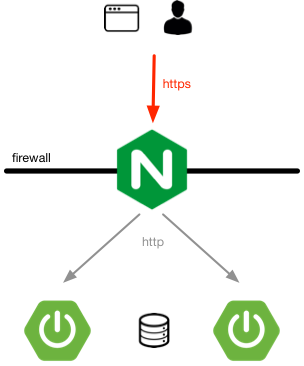

# IAM Deployment and Administration guide

This is the INDIGO IAM deployment and administration guide.

## IAM deployment overview

This section provides insight on how to deploy and configure an IAM service
instance.

IAM is a spring boot application designed to run behind an NGINX reverse proxy,
which is used for TLS termination and load balancing. The IAM service instances
keep all state in a MariaDB/MySQL database, as shown in the following picture:

### Prerequisites

At the bare minimum, to run a production instance of the instance of the IAM 
you will need:

- An X.509 certificate, used for SSL termination at the NGINX reverse proxy;
  you can get one for free from [Let's Encrypt][lets-encrypt];
- An NGINX server configured to act as a reverse proxy for the IAM web
  application; more details on this in [NGINX section](nginx.md);
- A MariaDB/MySQL database instance; more on this in the [MariaDB](mariadb.md)
  section;
- A JSON keystore holding the keys used to sign JSON Web Tokens; more on this
  in the [JWK section](json_web_key.md);

You will also need to choose whether you want to deploy you service as a
[docker container](docker.md) or install from [packages](packages.md).

In case you chose to install from [packages](packages.md) you can have a look
at the [IAM puppet module to deploy and configure the service](puppet.md).

And finally, you will have to setup a minimal IAM configuration and change the
administrator password for the newly configured IAM service; more on this
[here](basic_conf.md).

[docker-deployment]: docker.md
[packages-deployment]: packages.md
[puppet]: puppet.md
[lets-encrypt]: https://letsencrypt.org/
