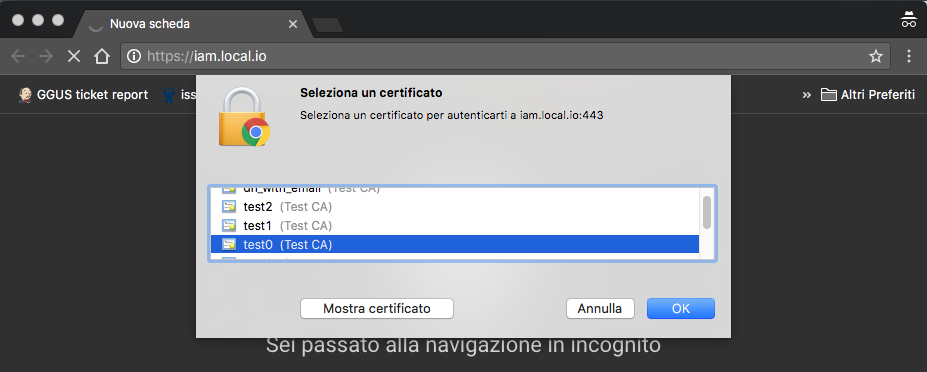
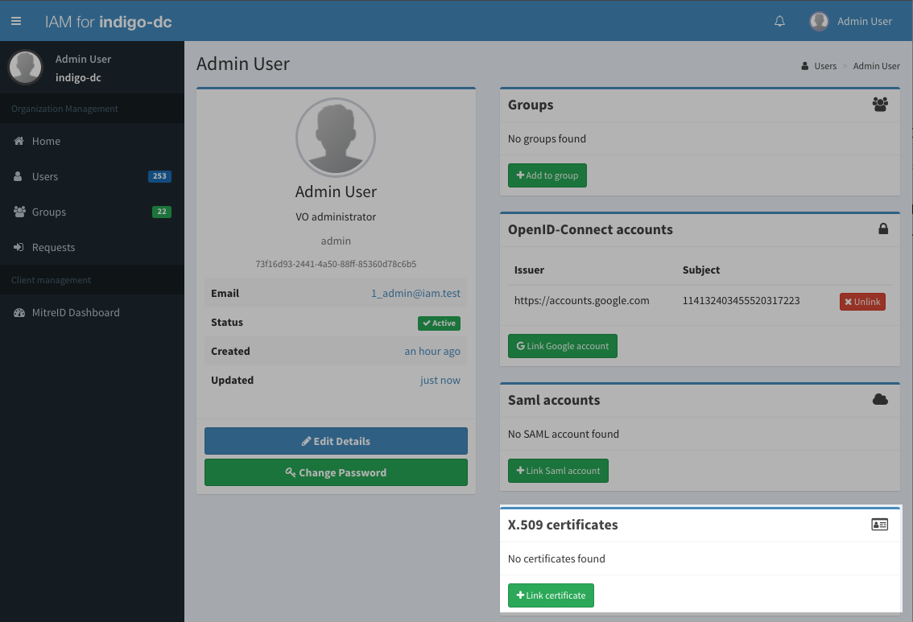
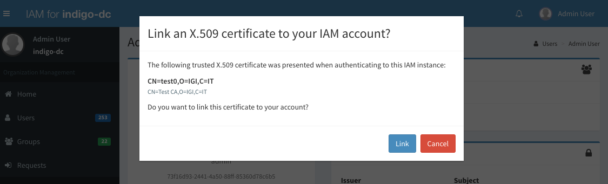
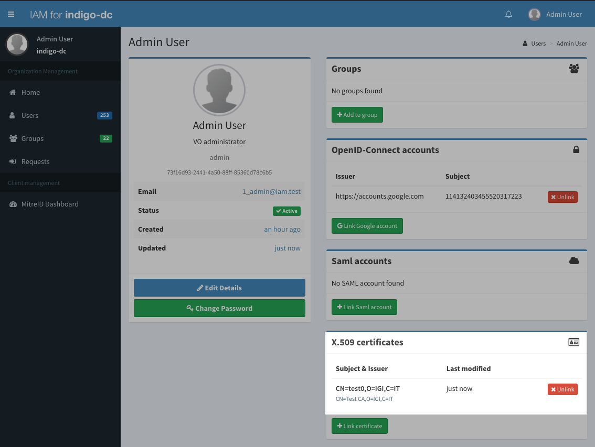
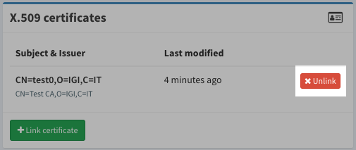

# Linking an X.509 certificate

IAM provides the ability to link X.509 certificates to a user account. X.509
account linking works if:

- X.509 certificate authentication is enabled for the IAM instance in use; for
  more information on this see the [deployment and administrator
  guide](../admin-guide);
- The certificate is correctly installed in the browser used to access the IAM;
- The certificate is trusted by the IAM (i.e. is signed by a certificate
  authority known and trusted by the IAM)

## Authenticating with an X.509 certificate 

If a certificate is correctly configured in the browser, the browser will show
a dialog to select whether to authenticate with the certificate or not as in the
following screenshot: 

Note that this happens when enstabilishing the connection to the IAM. If no
dialog is shown, either:

- there's certificate in the browser that is trusted by the IAM (either the
  certificate is expired or signed by a CA not trusted by the IAM)
- a certificate was selected automatically by the browser when authenticating
  to the IAM

## Linking a certificate

If a certificate was recognized but is not linked to any membership in the IAM,
the user will be redirected as usual to the IAM login page for authentication.

After having logged in, the user can link a certificate by clickin on the
__Link Certificate__ button:

Note that the __Link certificate__ button will be shown in the page __only if a
valid and trusted certificate was found in the TLS handshake__.

Clicking the __Link certificate__ button opens a dialog that shows information
about the certificate that should be linked to the account: 

If the linking completes succesfully, the linked certificate information will
be shown in the X.509 certificates panel:

Note that the logout functionality will apparently stop working when linking an
X.509 certificate to an account. This is expected behaviour since when you link
a certificate to your account that certificate will be trusted for
authentication for all the following requests so is not really possible to
logout unless:

- a new session the browser is created, and for such session no certificate is
  selected when authenticating to the IAM
- the certificate is unlinked from the account

## Unlinking a certificate

A user can unlink a certificate by clicking on the __Unlink__ button shown in
the certificate panel (see image above).

