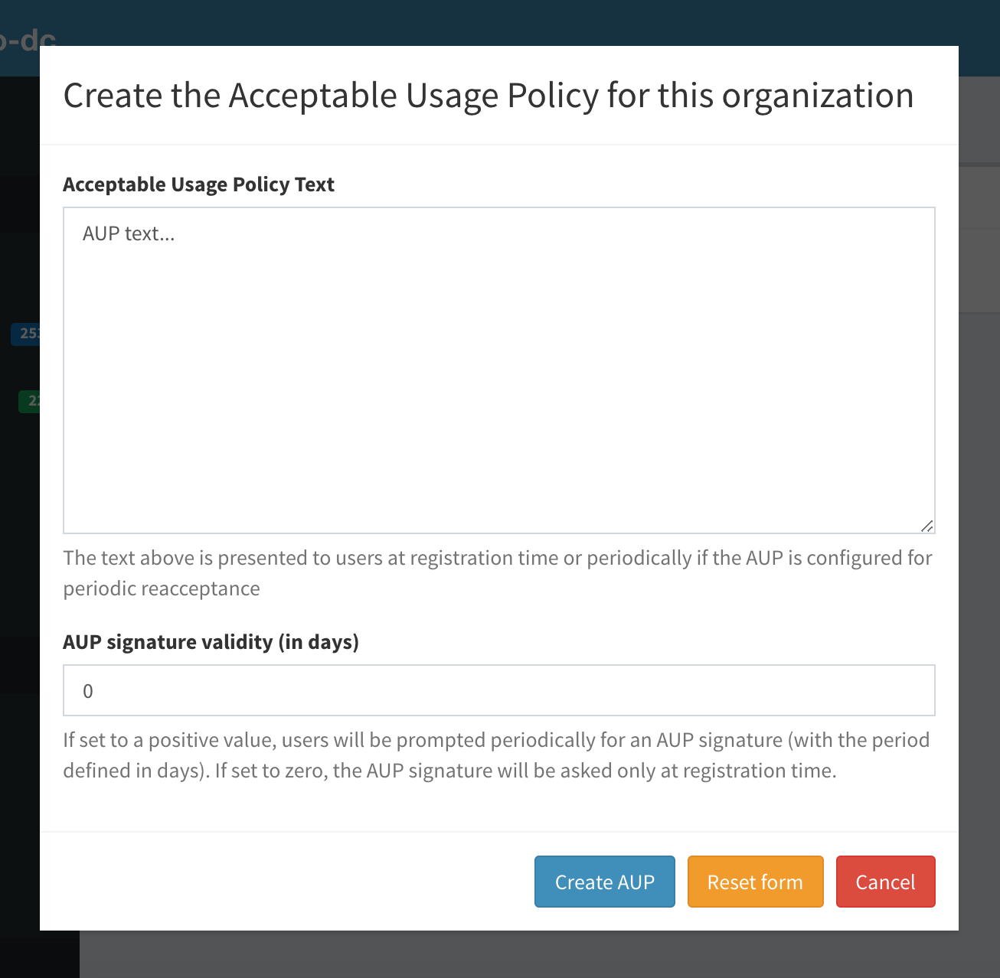
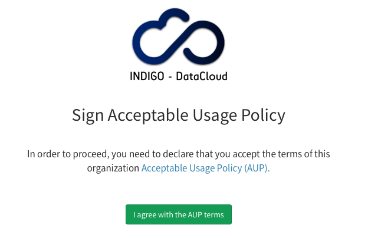

# Acceptable Usage Policy (AUP) management

Starting with version 1.2.0, IAM supports defining an **Acceptable Usage Policy
Document (AUP)** for a managed organization. The AUP is presented to applicants
at registration time or periodically. 

## Managing the AUP 

The AUP can be managed from the "AUP" section in the IAM dashboard, or via the
[AUP management API][aup-management-api]. 

Administrator privileges are required.

### Creating the AUP

By default, the AUP is not defined for an organization, i.e. it must be
explicitly defined by an IAM administrator. 

The AUP can be created by clicking on the "Create AUP" button in the AUP
management page (that can be reached clicking the "AUP" link in the organization
Management navigation bar):

A dialog is shown:

where the administrator can enter the AUP text and define how frequently the
AUP should be accepted by users. 

If the AUP signature validity is set to 0, a signature on the AUP will be
requested only once (either at registration time or at the first IAM login
after the AUP creation). A zero value means basically that the AUP signature
does not expire.

A positive value in the AUP signature validity means, on the other hand, that
the signature will expire after that number of days. As an example, an
administrator that wants the AUP to signed each year by users should put 365 in
the "AUP signature validity" field.

### Editing and deleting the AUP

The AUP can be edited and deleted from the AUP management page:

## Signing the AUP

Once defined the AUP text is shown to users for acceptance either
at registration time:

or at the first login after the AUP creation:

[aup-management-api]: #tbd

