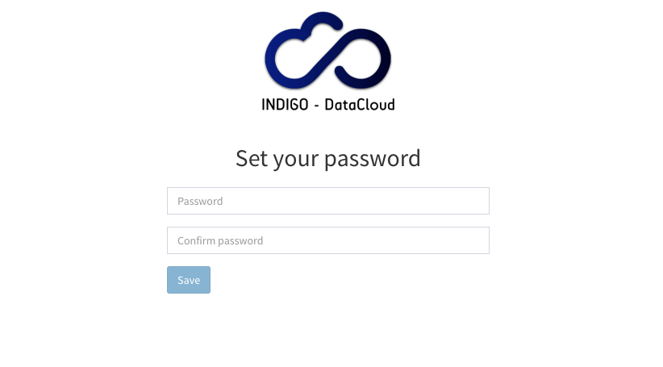

# Choosing a password 

Once a request is approved, an email is sent to the user with a reset password
link. This URL points to page where the user can choose a password for the IAM
account.

Once the password is set, users can login to the IAM using the username chosen
at registration time and the password.
