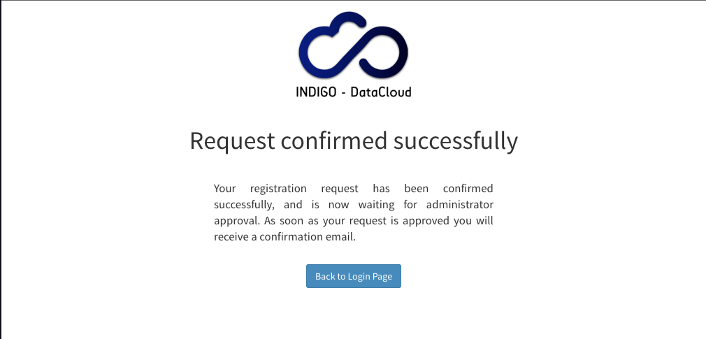

# Confirming a registration request

If the submission ends successfully, an email verification link is sent to the
user email address with a request to confirm his registration request.

Once the request is confirmed, IAM administrators are notified with an email.
