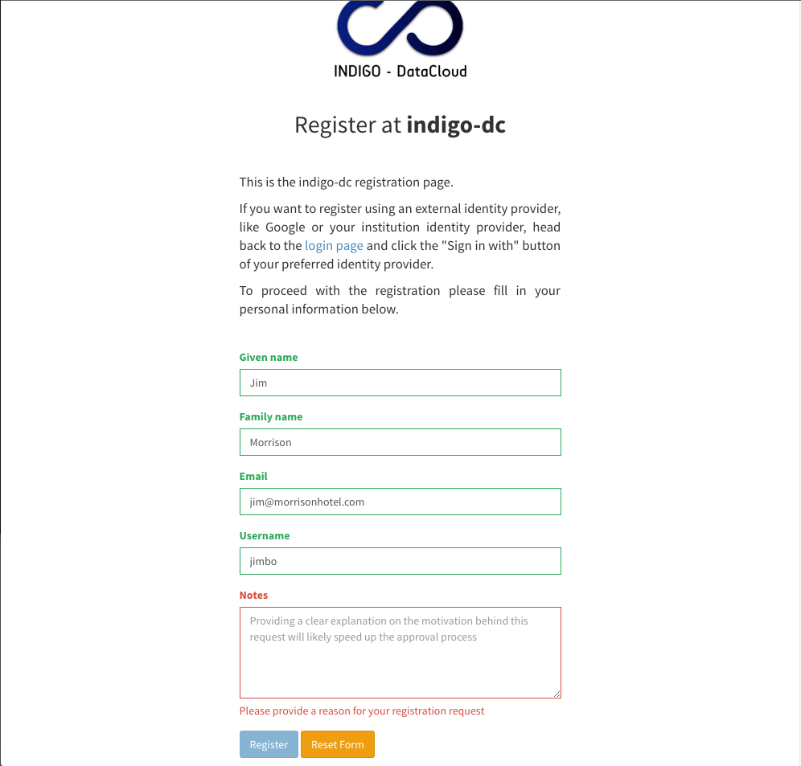

# Submitting a registration request 

Users can submit a registration request from the IAM login page in two ways:

- By clicking the _Register a new account_ button:

- By attempting a login with an external authentication provider such as Google
  or a configured SAML IdP: in this case if the external authentication
  succeeds and the authenticated user is not registered in the IAM the user is
  taken to the registration form to confirm the registration requests.

All the fields in the registration form are mandatory. The _notes_ field can
used to include extra information targeted at IAM administrators to clarify the
reasons behind a registration request.
